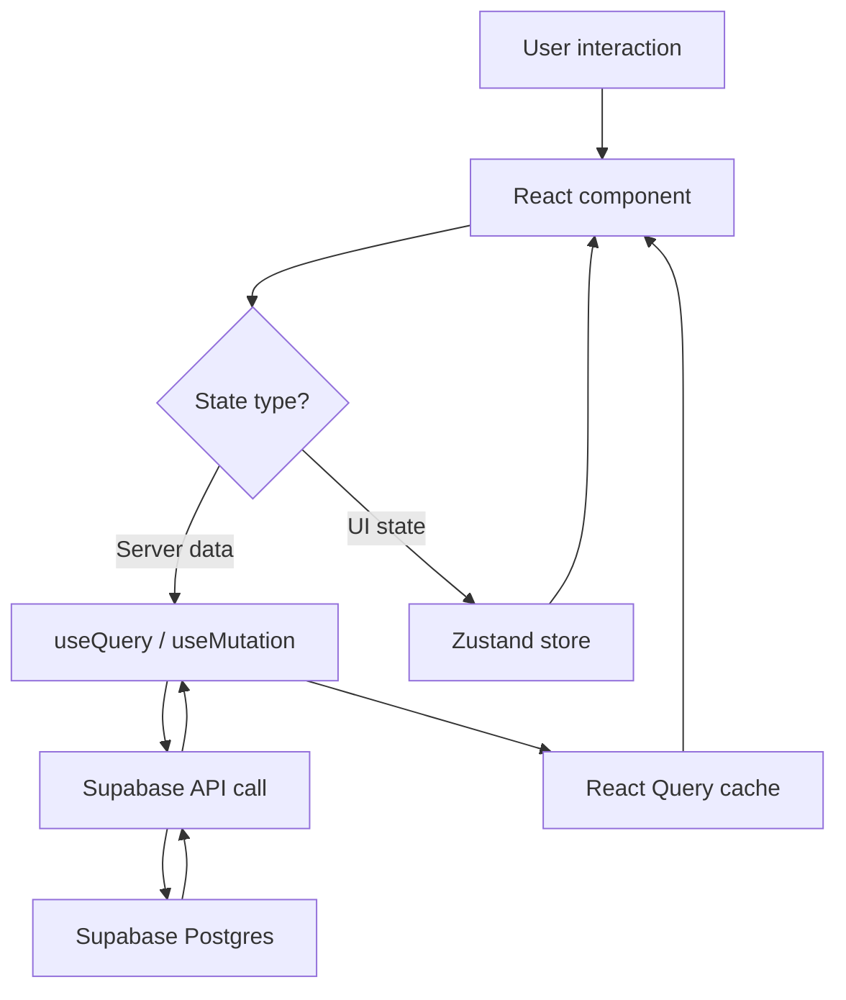
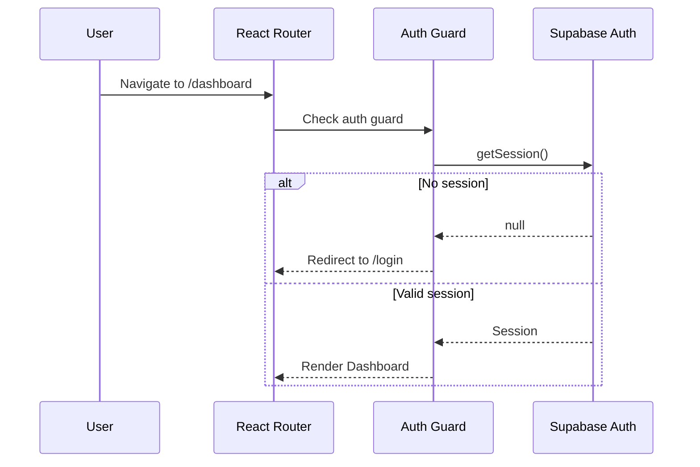

# Frontend Architecture

**Project:** SaaS Analytics Dashboard  
**Status:** Living document  
**Last updated:** 2025  
**Owner:** Frontend Engineering

---

## Overview

This document describes the architectural decisions, tradeoffs, and structural conventions for the SaaS Analytics Dashboard frontend. It is intended for engineers onboarding to the project and for future architectural review.

The dashboard is a **client-rendered SPA** built with React and Vite, deployed to Vercel, and backed by Supabase. It is an authenticated product — all routes require login — which drives the core rendering strategy decision.

---

## Rendering Strategy

### Decision: Client-Side Rendering (CSR) via Vite SPA

We use Vite to produce a purely client-rendered single-page application. There is no server-side rendering, no static generation, and no server components.

**Why not Next.js?**

Next.js is the correct choice for applications that need:
- SEO for public-facing routes
- Fast first-paint for unauthenticated content
- Server components for database-proxied data fetching
- Incremental Static Regeneration for content-heavy pages

This dashboard has none of those requirements. Every route is behind authentication. Search engines cannot and should not index user-specific analytics data. The network round-trip for SSR adds latency without benefit when the user is already authenticated and the browser already holds a valid session token.

**Tradeoff accepted:** Initial bundle download before first paint. We mitigate this with:
- Route-level code splitting via `React.lazy()` and `Suspense`
- Asset preloading for critical routes
- Aggressive caching via React Query

**Tradeoff not accepted:** SSR complexity for zero measurable user benefit.

---

## Tech Stack

| Concern | Library | Version | Rationale |
|---|---|---|---|
| UI framework | React | 18 | Concurrent features, ecosystem |
| Language | TypeScript | 5.x | Strict mode, type safety |
| Build tool | Vite | 5.x | Fast HMR, ESM-native |
| Routing | React Router | 6.x | Nested routes, data loaders |
| Server state | TanStack Query | 5.x | Caching, background sync |
| Client state | Zustand | 4.x | Minimal API, no boilerplate |
| Styling | Tailwind CSS | 3.x | Utility-first, dark mode |
| Tables | TanStack Table | 8.x | Headless, fully composable |
| Charts | Recharts | 2.x | React-native, composable |
| Backend | Supabase | 2.x | Auth, DB, Realtime, Storage |

---

## State Management

### The core principle: server state ≠ client state

These are fundamentally different problems that require different tools.

**Server state** lives on a remote server, has a source of truth we don't own, can become stale at any time, and requires caching, background refresh, and invalidation strategies. Examples: user list, analytics events, audit logs, notifications.

**Client state** exists only in the browser, represents UI decisions, never goes stale (we own it), and requires no caching. Examples: sidebar open/closed, active filters, dark mode preference, modal visibility.

### React Query — server state

React Query manages all data fetched from Supabase. Key configuration decisions:

```ts
const queryClient = new QueryClient({
  defaultOptions: {
    queries: {
      staleTime: 1000 * 60 * 5,      // 5 minutes — data is fresh for 5 min
      gcTime: 1000 * 60 * 10,        // 10 minutes — cache retained for 10 min
      retry: 2,                       // retry failed requests twice
      retryDelay: attemptIndex =>
        Math.min(1000 * 2 ** attemptIndex, 10000), // exponential backoff
      refetchOnWindowFocus: true,     // re-validate when user returns to tab
    },
  },
})
```

**staleTime vs gcTime:** `staleTime` controls how long data is considered fresh — React Query won't re-fetch during this window. `gcTime` controls how long inactive cache entries are retained before garbage collection. A query that is not currently rendered (the component unmounted) is "inactive" and will be GC'd after `gcTime`.

For the dashboard, 5-minute stale time balances freshness against unnecessary network requests for analytics data that rarely changes second-to-second. The AI insights panel uses a longer stale time (15 minutes) since AI-generated summaries are expensive to produce. The notifications panel uses a shorter stale time (30 seconds) since users expect near-real-time updates.

### Zustand — client state

Three stores, each with a single responsibility:

| Store | Responsibility |
|---|---|
| `useUIStore` | Sidebar state, active modal, command palette open |
| `useThemeStore` | Dark/light mode, persisted to localStorage |
| `useFiltersStore` | Active dashboard filters, date range, segment selection |

**Why not one big store?** A single Zustand store is fine for small apps. As the app grows, a monolithic store causes entire component trees to re-render when any slice updates. Separate stores mean a component subscribing to `useThemeStore` does not re-render when filter state changes.

**Why not Redux?** Redux is the right tool for large teams with complex shared state, time-travel debugging requirements, and strict action/reducer discipline. For this codebase, Redux adds ~12kb to the bundle, requires 3-5x more boilerplate per feature, and provides tooling that doesn't justify its cost at this scale. Zustand achieves the same result in ~1kb.

---

## Folder Structure

```
src/
├── features/               # Domain-scoped feature modules
│   ├── auth/
│   │   ├── components/     # Login form, auth guards
│   │   ├── hooks/          # useAuth, useRequireAuth
│   │   ├── api/            # Supabase auth calls
│   │   └── types.ts        # User, Session types
│   ├── dashboard/
│   ├── analytics/
│   ├── audit-logs/
│   ├── notifications/
│   └── onboarding/
├── shared/
│   ├── components/         # Reusable, feature-agnostic UI
│   │   ├── Button/
│   │   ├── Table/
│   │   ├── Modal/
│   │   └── ...
│   ├── hooks/              # Cross-feature hooks
│   ├── lib/                # Configured third-party clients
│   │   ├── queryClient.ts
│   │   ├── supabaseClient.ts
│   │   └── ...
│   ├── types/              # Global TypeScript types
│   └── utils/              # Pure utility functions
├── routes/                 # Route config, lazy imports, guards
├── layouts/                # AppLayout, AuthLayout
└── styles/                 # Global CSS, Tailwind base
```

### The import rule

Features may import from `shared/`. Features must not import from other features.

If feature A needs logic from feature B, that logic belongs in `shared/`. This rule enforces a dependency graph that stays maintainable as the team and codebase grow.

```
✅  features/analytics/hooks/useAnalyticsData.ts
      imports from shared/lib/queryClient
      imports from shared/utils/formatDate

❌  features/analytics/hooks/useAnalyticsData.ts
      imports from features/auth/hooks/useAuth  ← move to shared
```

---

## Component Architecture

### Shared components are headless-first

Shared components in `src/shared/components/` expose structure and behavior, not opinionated styling. Consumers apply Tailwind classes via the `className` prop.

This follows the principle that a `Button` component should handle focus management, ARIA attributes, loading state, and disabled state — but the visual appearance is the consumer's responsibility.

### Co-location of tests

Tests live next to the files they test:

```
features/auth/components/
├── LoginForm.tsx
├── LoginForm.test.tsx     ← co-located
```

This makes it immediately obvious when a file has no test coverage, and ensures tests are updated when the component is modified.

---

## Performance Strategy

### Code splitting

Every route is lazy-loaded:

```tsx
const Dashboard = lazy(() => import('@/features/dashboard/pages/Dashboard'))
const Analytics = lazy(() => import('@/features/analytics/pages/Analytics'))
```

This ensures the initial bundle only contains the auth flow. The dashboard chunk, analytics chunk, and other feature chunks are fetched on-demand when the user navigates. Users who only use two features never download code for the other eight.

### Memoization policy

We follow a deliberate memoization policy rather than applying `memo`, `useMemo`, and `useCallback` everywhere:

- **`memo`:** Apply to components that receive stable props but whose parents re-render frequently. Not applied by default — measure first.
- **`useMemo`:** Apply to expensive computations (data transforms, derived analytics) that run on every render. Not applied to simple object/array creation unless the result is passed to a memoized child.
- **`useCallback`:** Apply to callbacks passed as props to memoized children. Unnecessary otherwise.

Premature memoization adds cognitive overhead and can mask actual performance problems. Profile with React DevTools Profiler before adding `memo`.

### Virtualization

Tables and lists with more than ~50 rows use TanStack Virtual for row virtualization. This ensures the DOM never contains more than ~20 rows regardless of data size, keeping scroll performance consistent at 10 rows or 10,000.

---

## Error Handling

### Error boundaries

Each major feature route wraps its content in an `ErrorBoundary`. A crash in the Analytics feature does not crash the Notifications panel or the sidebar.

```
<ErrorBoundary fallback={<FeatureError />}>
  <Analytics />
</ErrorBoundary>
```

The fallback component shows a user-friendly message with a retry action, not a blank screen or a raw error stack.

### React Query error handling

Query errors are handled at two levels:

1. **Per-query level:** Components that need specific error UI (inline error states, retry buttons) handle errors from `useQuery`'s returned `isError` and `error` fields.
2. **Global level:** The `QueryClient` is configured with an `onError` handler that feeds into the notification system for unexpected errors.

---

## Architectural Diagrams

### Data flow



### Authentication flow



---

## Scalability Considerations

### What scales well

- Feature-based folder structure grows linearly — new features add folders, not noise
- React Query cache is a normalized layer; multiple components accessing the same data share one fetch
- Zustand stores are composable; new UI concerns get new stores without modifying existing ones
- Code splitting means bundle size grows proportionally to features added, not exponentially

### What breaks at scale

- **Single Supabase client:** At very high concurrency, connection pooling in Supabase's free/pro tier becomes a ceiling. The architecture is designed to add an edge function layer between the client and Postgres when this limit is reached.
- **Client-side filtering/sorting:** TanStack Table performs filtering and sorting on in-memory data. For datasets exceeding ~50,000 rows, this needs to move server-side. The API layer is designed with this transition in mind — moving from client-side filters to query parameters is a localized change.
- **WebSocket connections:** Each Supabase Realtime subscription is a persistent WebSocket connection. High numbers of concurrent subscriptions per client can degrade performance. We colocate all realtime subscriptions into dedicated hooks to make auditing and consolidation straightforward.

---

## Local Development

```bash
# Install dependencies
npm install

# Copy environment variables
cp .env.example .env.local

# Start dev server
npm run dev

# Type check
npm run type-check

# Lint
npm run lint

# Test
npm run test
```

---

## Related Documents

- [Auth Flow](./auth-flow.md)
- [State Management](./state-management.md)
- [Rendering Strategy](./rendering-strategy.md)
- [Performance Optimizations](./performance-optimizations.md)
- [Deployment Strategy](./deployment-strategy.md)
